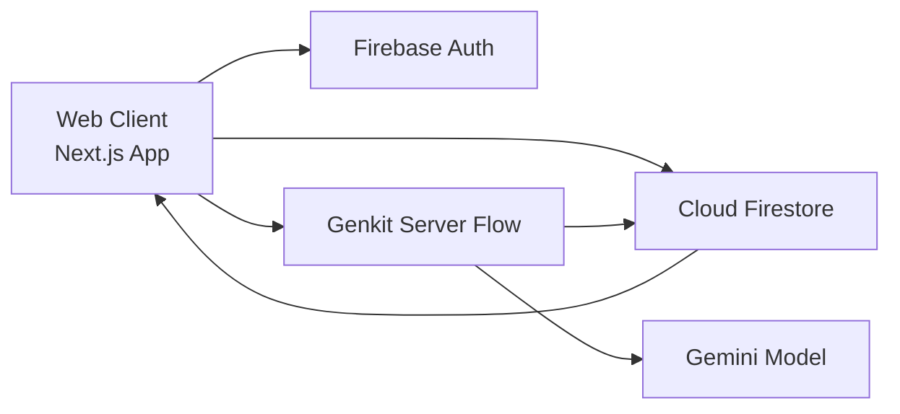

# Nexus Study — Collaborative Study Room Platform

#  Collaborative Study Room Platform

Students preparing for exams or interviews often struggle to stay consistent 
while studying alone. Existing communication tools lack focused collaboration 
and accountability features designed specifically for group study sessions. 
This is a web-based collaborative study room platform where users can create 
virtual study rooms, invite participants, track study sessions, and collaborate in 
real-time.
The ultimate collaborative platform for modern learners, built for high-performance deep work and AI-powered insights. Nexus Study transforms solitary studying into a synchronized, gamified, and intelligent team experience.

## User Stories 
As a User 
• able to create study rooms.  
• able to invite other users.  
• able to start study sessions.  
• able to track session durations.  
• able to communicate within the room.  
• able to view room activity history. 

## 🚀 Features

---

## Tech Stack

Derived from `package.json` and project structure.

### Frontend
- **Next.js 15** (App Router)
- **React 19**
- **TypeScript**
- **Tailwind CSS**
- **shadcn/ui + Radix UI primitives**
- **Framer Motion**, **Lucide icons**, **Recharts**, **date-fns**

### Backend / Data / Realtime
- **Firebase Authentication**
- **Cloud Firestore** (documents + subcollections + collection group queries)
- Realtime updates via Firestore listeners (`onSnapshot`)

### AI
- **Genkit**
- **Google Gemini model via `@genkit-ai/google-genai`**

### State & Form Tooling
- **Zustand** (auth store)
- **react-hook-form** + **zod**

### Build / Dev / Deployment
- `next dev`, `next build`, `next start`
- Type checks: `tsc --noEmit`
- Lint script: `next lint`
- Containerization: **Docker** + **docker-compose**
- Firebase App Hosting config present: `apphosting.yaml`

---

## Architecture & Implementation Notes

### High-level Architecture



### Data/Flow Summary
- Client authenticates through Firebase Auth.
- Core entities (users, rooms, sessions, messages, logs, recaps) are stored in Firestore.
- Room chat, typing, room activity, and session state updates are consumed in real time via Firestore listeners.
- AI recap flow pulls room context, calls Gemini through Genkit, and persists generated recaps back to Firestore.

### Folder Structure (key areas)

```text
src/
  app/
    (auth)/                # login/register pages
    (dashboard)/           # dashboard, profile, recaps, room pages
    join/                  # join room by invite code
  components/
    rooms/                 # room UI: creation, notes, leaderboard, summary trigger
    sessions/              # session dialogs, timer UI, history
    chat/                  # chat bubbles, typing indicators
    dashboard/             # charts/cards/analytics widgets
    auth/                  # route guard
    ui/                    # shared UI primitives
  firebase/
    auth/                  # auth hooks
    firestore/             # firestore data hooks
    config/provider setup
  ai/
    flows/                 # AI flow definitions
  hooks/                   # custom feature hooks (focus mode, chat socket, etc.)
  lib/                     # utilities and stores
```

---

## Project Setup Instructions

## Prerequisites

- Node.js 18+
- npm 9+
- Firebase project with:
  - Authentication enabled (Email/Password and Anonymous if demo access is required)
  - Firestore database enabled
- Gemini API access for Genkit recap generation

## 1) Clone and install

```bash
git clone <repository-url>
cd <repository-folder>
npm ci
```

## 2) Configure environment variables

Create a `.env` file in project root (you can copy from `.env.example`).

```bash
cp .env.example .env
```

Fill required values:

- `NEXT_PUBLIC_FIREBASE_API_KEY`
- `NEXT_PUBLIC_FIREBASE_AUTH_DOMAIN`
- `NEXT_PUBLIC_FIREBASE_PROJECT_ID`
- `NEXT_PUBLIC_FIREBASE_STORAGE_BUCKET`
- `NEXT_PUBLIC_FIREBASE_MESSAGING_SENDER_ID`
- `NEXT_PUBLIC_FIREBASE_APP_ID`
- `NEXT_PUBLIC_FIREBASE_MEASUREMENT_ID` (optional)
- `GEMINI_API_KEY` (required for recap generation)

## 3) Run locally

```bash
npm run dev
```

Default local URL: `http://localhost:9002`

## 4) Available scripts

```bash
npm run dev         # Start Next.js dev server (port 9002)
npm run build       # Production build
npm run start       # Run production server
npm run typecheck   # TypeScript checks
npm run lint        # Next lint (see Known Constraints section)
npm run genkit:dev  # Start Genkit dev runtime
npm run genkit:watch
```

## 5) Production build / deploy options

### Option A: Standard Next.js build
```bash
npm run build
npm run start
```

### Option B: Docker
```bash
docker compose up -d --build
```

### Option C: Firebase App Hosting
- `apphosting.yaml` is present for Firebase App Hosting runtime settings.

---

## Usage Guide

### A) Create a room
1. Login/Register (or use Guest access).
2. Open **Dashboard**.
3. Click **Create Room**.
4. Enter title, category, max members, and description.
5. Share generated 6-character invite code with peers.

### B) Join a room
1. Go to **Join Hub** (`/join`).
2. Enter invite code.
3. If valid and capacity allows, user is added to room and redirected.

### C) Start a study session
1. Open room.
2. In **Focus** tab, click **Start Focus Session**.
3. Set goal and duration, or enable Pomodoro mode.
4. Session state and timer become active for room participants.

### D) Chat and collaborate
1. Switch to **Hub Chat** tab for live messages.
2. Use **Board** tab for shared notes with autosave.
3. Use **Telemetry** tab to review room action history.

### E) View progress and activity
1. Open **Dashboard** for overall analytics and room list.
2. Open **AI Recaps** page to review generated recap cards.
3. Open **Profile/Settings** to update identity and weekly goals.

---

## Realtime Events Overview

Realtime behavior is implemented primarily using Firestore listeners (`onSnapshot`).

| Area | Firestore Path | Realtime Purpose |
|---|---|---|
| Room chat | `rooms/{roomId}/messages` | Live message feed in room chat tab |
| Typing indicators | `rooms/{roomId}/typing` | Shows who is typing |
| Room document | `rooms/{roomId}` | Shared notes and active session state updates |
| Sessions | `rooms/{roomId}/sessions` | Active/completed session lifecycle |
| Activity logs | `rooms/{roomId}/logs` | Accountability timeline updates |
| Recaps | `rooms/{roomId}/recaps` + collection group query | Recap archive discovery |

---

## Screenshots

Add screenshots to `docs/screenshots/` (or preferred folder) and replace placeholders below.

1. 
2. 
3. 
4. 
5. 

---

## Known Constraints

- `npm run lint` currently launches Next.js ESLint setup prompt when no ESLint config is present. Recommended: run the prompt once and commit the generated ESLint config for stable lint behavior.
- Production builds require valid Firebase env configuration at build/runtime (invalid API key causes prerender failure).
- `next.config.ts` currently skips lint/type checks during build (`ignoreBuildErrors` and `ignoreDuringBuilds` enabled).

---

## Contributing

Contributions are welcome.

1. Fork the repository.
2. Create a feature branch.
3. Make focused, tested changes.
4. Open a pull request with:
   - clear problem statement,
   - implementation summary,
   - testing notes,
   - screenshots (if UI changes).

Suggested local validation before opening PR:

```bash
npm run typecheck
npm run build
```

---

## License

No license file is currently present in this repository.  
Until a license is added, default copyright rules apply.  
If open-source distribution is intended, add a license file (for example: MIT).

---
