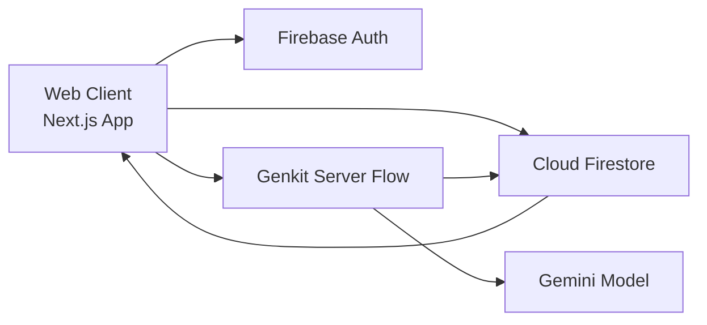

# Nexus Study — Collaborative Study Room Platform

Nexus Study is a web-based collaborative study room platform designed for students preparing for exams, interviews, and project milestones. It helps learners stay consistent by combining **real-time group focus sessions**, **in-room communication**, and **accountability-oriented activity tracking** in one place.

> Demo link: _Add deployed URL here_  
> Screenshots: Placeholders included in the [Screenshots](#screenshots) section.

---

## Table of Contents

- [Project Overview](#project-overview)
- [Problem Statement](#problem-statement)
- [How Nexus Study Solves It](#how-nexus-study-solves-it)
- [Core User Stories](#core-user-stories)
- [Features Implemented (Current Codebase)](#features-implemented-current-codebase)
- [Additional Functionalities & Enhancements](#additional-functionalities--enhancements)
- [Tech Stack](#tech-stack)
- [Architecture & Implementation Notes](#architecture--implementation-notes)
- [Project Setup Instructions](#project-setup-instructions)
- [Usage Guide](#usage-guide)
- [Realtime Events Overview](#realtime-events-overview)
- [Screenshots](#screenshots)
- [Known Constraints](#known-constraints)
- [Contributing](#contributing)
- [License](#license)
- [Acknowledgements](#acknowledgements)

---

## Project Overview

Nexus Study is built around one goal: make collaborative studying structured and consistent instead of ad-hoc and distracting.

Students can:
- create study rooms,
- invite peers using room codes,
- run timed focus sessions (standard or Pomodoro),
- chat in real time,
- maintain shared notes,
- and review activity + AI-generated recap history.

The platform combines productivity workflows and collaboration features so teams can study together with clearer accountability.

## Problem Statement

Students often struggle to stay consistent when studying alone. General-purpose communication tools support messaging, but they typically do not provide built-in study structure (session timing, room-based accountability, focused workflow tools, study analytics).

## How Nexus Study Solves It

Nexus Study addresses this by providing a study-first workspace:
1. **Structured room lifecycle** (create/join by invite code).
2. **Synchronized session flow** (timers + Pomodoro support).
3. **Live collaboration** (chat, typing indicators, shared notes).
4. **Accountability signals** (logs, leaderboard, dashboards, progress metrics).
5. **Reflection layer** (AI recaps generated from room chat + activity logs).

## Core User Stories

As a user:
- I can create study rooms.
- I can invite participants via room invite code.
- I can join study rooms.
- I can start and end focus sessions.
- I can track session duration and outcomes.
- I can communicate with room members in real time.
- I can view room activity history.
- I can review analytics and generated recap summaries.

---

## Features Implemented (Current Codebase)

This section lists features verified from the repository code and where each appears in the user journey.

### 1) Authentication (Email/Password + Guest Demo Access)
**What it does**
- Supports user registration and login with Firebase Auth.
- Supports anonymous “Guest Scholar” entry for demo-style exploration.
- Protects private routes via auth guard.

**Where it fits in the journey**
- Entry step before dashboard and room access.

**Relevant code**
- `src/app/(auth)/login/page.tsx`
- `src/app/(auth)/register/page.tsx`
- `src/components/auth/auth-guard.tsx`
- `src/firebase/auth/use-user.tsx`

---

### 2) Study Room Creation & Membership by Invite Code
**What it does**
- Create room with title, description, category, max members.
- Generates 6-character invite code.
- Join room using invite code.
- Enforces member capacity check.

**Where it fits in the journey**
- Setup phase of group studying.

**Relevant code**
- `src/components/rooms/create-room-dialog.tsx`
- `src/app/join/page.tsx`
- `src/types/study.ts`

---

### 3) Real-time Room Workspace
**What it does**
- Dedicated room page with tabs for Focus, Chat, Shared Board, and Activity telemetry.
- Displays room metadata, category, and invite code.

**Where it fits in the journey**
- Main collaboration area after room join.

**Relevant code**
- `src/app/(dashboard)/rooms/[id]/page.tsx`

---

### 4) Focus Sessions (Standard Timer + Pomodoro)
**What it does**
- Start session with goal and duration preset.
- Optional Pomodoro mode (focus/break phase switching).
- Session status updates (`ACTIVE`, `COMPLETED`, `CANCELLED`).
- Timer visualization and alert transitions.

**Where it fits in the journey**
- Active deep-work execution step.

**Relevant code**
- `src/components/sessions/start-session-dialog.tsx`
- `src/components/sessions/timer-wheel.tsx`
- `src/app/(dashboard)/rooms/[id]/page.tsx`
- `src/types/study.ts`

---

### 5) Room Chat + Typing Indicators
**What it does**
- Real-time message stream for each room.
- Typing status updates using `rooms/{roomId}/typing` collection.
- Sends both user and system messages.

**Where it fits in the journey**
- Coordination during live study sessions.

**Relevant code**
- `src/hooks/use-chat-socket.ts`
- `src/components/chat/message-bubble.tsx`
- `src/components/chat/typing-indicator.tsx`
- `src/app/(dashboard)/rooms/[id]/page.tsx`

---

### 6) Shared Notes Board
**What it does**
- Collaborative note area stored on room document (`sharedNotes`).
- Auto-save behavior with debounce.
- Edit and preview tabs.

**Where it fits in the journey**
- During and after sessions for shared understanding.

**Relevant code**
- `src/components/rooms/shared-notes.tsx`

---

### 7) Room Activity Telemetry (History Feed)
**What it does**
- Logs room actions to `rooms/{roomId}/logs`.
- Displays recent activity in room “Telemetry” tab.

**Where it fits in the journey**
- Accountability and audit trail for room activity.

**Relevant code**
- `src/components/rooms/create-room-dialog.tsx`
- `src/app/(dashboard)/rooms/[id]/page.tsx`

---

### 8) Dashboard Analytics & Progress Tracking
**What it does**
- Shows cumulative focus stats, weekly goal progress, trend chart, heatmap, room list.
- Includes guest/demo-mode mock analytics when anonymous user has no real sessions.

**Where it fits in the journey**
- Ongoing performance review and consistency tracking.

**Relevant code**
- `src/app/(dashboard)/dashboard/page.tsx`
- `src/components/dashboard/focus-trend-chart.tsx`
- `src/components/dashboard/contribution-heatmap.tsx`
- `src/components/dashboard/stat-card.tsx`

---

### 9) AI Session Recaps (Genkit + Gemini)
**What it does**
- Collects recent chat + activity context.
- Generates structured session summary (title, overview, key points, decisions).
- Stores recap in Firestore and surfaces in recaps page.

**Where it fits in the journey**
- Post-session reflection and review workflow.

**Relevant code**
- `src/components/rooms/generate-summary-button.tsx`
- `src/ai/flows/generate-session-summary.ts`
- `src/app/(dashboard)/recaps/page.tsx`
- `src/ai/genkit.ts`

---

### 10) Profile & Personal Goal Management
**What it does**
- Edit profile metadata (display name, avatar URL, bio).
- Configure weekly study goal.

**Where it fits in the journey**
- Personal setup and longitudinal planning.

**Relevant code**
- `src/app/(dashboard)/profile/page.tsx`
- `src/app/(dashboard)/settings/page.tsx`

---

## Additional Functionalities & Enhancements

### Already Implemented (Beyond baseline)
- **Focus Mode toggle** to declutter room interface (`Ctrl + Shift + F`).
- **Anonymous demo access** with sample analytics behavior for first-time exploration.
- **Room leaderboard** based on cumulative completed session minutes.
- **AI-generated recap archive** with room-linked recap cards.
- **Shared board (notes) with autosave**.
- **Keyboard-centric workflow guidance** in built-in guide page.

### Planned / Recommended Enhancements
> The following are **not fully implemented yet** in the repository and are recommended roadmap items.

1. **Role-based room permissions (Planned)**  
   Owner / Moderator / Participant permissions for session control, note locking, and moderation actions.

2. **Room moderation toolkit (Planned)**  
   Message reporting, temporary mute, and room-ban controls.

3. **Notification engine (Planned)**  
   Browser + email reminders for upcoming sessions and inactivity recovery nudges.

4. **Session templates & Pomodoro presets (Planned)**  
   Save reusable focus templates (e.g., 50/10 deep work, revision sprint).

5. **Achievement badges (Planned)**  
   Milestone badges for streaks, consistency, and collaborative contribution.

6. **Advanced analytics (Planned)**  
   Cohort-level insights, personal trend anomaly detection, completion rates by category.

7. **Invite links + calendar integrations (Planned)**  
   One-click room onboarding and scheduled session coordination.

8. **In-room task checklist (Planned)**  
   Shared actionable checklist aligned to session goals.

---

## Tech Stack

Derived from `package.json` and project structure.

### Frontend
- **Next.js 15** (App Router)
- **React 19**
- **TypeScript**
- **Tailwind CSS**
- **shadcn/ui + Radix UI primitives**
- **Framer Motion**, **Lucide icons**, **Recharts**, **date-fns**

### Backend / Data / Realtime
- **Firebase Authentication**
- **Cloud Firestore** (documents + subcollections + collection group queries)
- Realtime updates via Firestore listeners (`onSnapshot`)

### AI
- **Genkit**
- **Google Gemini model via `@genkit-ai/google-genai`**

### State & Form Tooling
- **Zustand** (auth store)
- **react-hook-form** + **zod**

### Build / Dev / Deployment
- `next dev`, `next build`, `next start`
- Type checks: `tsc --noEmit`
- Lint script: `next lint`
- Containerization: **Docker** + **docker-compose**
- Firebase App Hosting config present: `apphosting.yaml`

---

## Architecture & Implementation Notes

### High-level Architecture



### Data/Flow Summary
- Client authenticates through Firebase Auth.
- Core entities (users, rooms, sessions, messages, logs, recaps) are stored in Firestore.
- Room chat, typing, room activity, and session state updates are consumed in real time via Firestore listeners.
- AI recap flow pulls room context, calls Gemini through Genkit, and persists generated recaps back to Firestore.

### Folder Structure (key areas)

```text
src/
  app/
    (auth)/                # login/register pages
    (dashboard)/           # dashboard, profile, recaps, room pages
    join/                  # join room by invite code
  components/
    rooms/                 # room UI: creation, notes, leaderboard, summary trigger
    sessions/              # session dialogs, timer UI, history
    chat/                  # chat bubbles, typing indicators
    dashboard/             # charts/cards/analytics widgets
    auth/                  # route guard
    ui/                    # shared UI primitives
  firebase/
    auth/                  # auth hooks
    firestore/             # firestore data hooks
    config/provider setup
  ai/
    flows/                 # AI flow definitions
  hooks/                   # custom feature hooks (focus mode, chat socket, etc.)
  lib/                     # utilities and stores
```

---

## Project Setup Instructions

## Prerequisites

- Node.js 18+
- npm 9+
- Firebase project with:
  - Authentication enabled (Email/Password and Anonymous if demo access is required)
  - Firestore database enabled
- Gemini API access for Genkit recap generation

## 1) Clone and install

```bash
git clone <repository-url>
cd nexus-hck-asgn
npm ci
```

## 2) Configure environment variables

Create a `.env` file in project root (you can copy from `.env.example`).

```bash
cp .env.example .env
```

Fill required values:

- `NEXT_PUBLIC_FIREBASE_API_KEY`
- `NEXT_PUBLIC_FIREBASE_AUTH_DOMAIN`
- `NEXT_PUBLIC_FIREBASE_PROJECT_ID`
- `NEXT_PUBLIC_FIREBASE_STORAGE_BUCKET`
- `NEXT_PUBLIC_FIREBASE_MESSAGING_SENDER_ID`
- `NEXT_PUBLIC_FIREBASE_APP_ID`
- `NEXT_PUBLIC_FIREBASE_MEASUREMENT_ID` (optional)
- `GEMINI_API_KEY` (required for recap generation)

## 3) Run locally

```bash
npm run dev
```

Default local URL: `http://localhost:9002`

## 4) Available scripts

```bash
npm run dev         # Start Next.js dev server (port 9002)
npm run build       # Production build
npm run start       # Run production server
npm run typecheck   # TypeScript checks
npm run lint        # Next lint (currently prompts if ESLint config missing)
npm run genkit:dev  # Start Genkit dev runtime
npm run genkit:watch
```

## 5) Production build / deploy options

### Option A: Standard Next.js build
```bash
npm run build
npm run start
```

### Option B: Docker
```bash
docker compose up -d --build
```

### Option C: Firebase App Hosting
- `apphosting.yaml` is present for Firebase App Hosting runtime settings.

---

## Usage Guide

### A) Create a room
1. Login/Register (or use Guest access).
2. Open **Dashboard**.
3. Click **Create Room**.
4. Enter title, category, max members, and description.
5. Share generated 6-character invite code with peers.

### B) Join a room
1. Go to **Join Hub** (`/join`).
2. Enter invite code.
3. If valid and capacity allows, user is added to room and redirected.

### C) Start a study session
1. Open room.
2. In **Focus** tab, click **Start Focus Session**.
3. Set goal and duration, or enable Pomodoro mode.
4. Session state and timer become active for room participants.

### D) Chat and collaborate
1. Switch to **Hub Chat** tab for live messages.
2. Use **Board** tab for shared notes with autosave.
3. Use **Telemetry** tab to review room action history.

### E) View progress and activity
1. Open **Dashboard** for overall analytics and room list.
2. Open **AI Recaps** page to review generated recap cards.
3. Open **Profile/Settings** to update identity and weekly goals.

---

## Realtime Events Overview

Realtime behavior is implemented primarily using Firestore listeners (`onSnapshot`).

| Area | Firestore Path | Realtime Purpose |
|---|---|---|
| Room chat | `rooms/{roomId}/messages` | Live message feed in room chat tab |
| Typing indicators | `rooms/{roomId}/typing` | Shows who is typing |
| Room document | `rooms/{roomId}` | Shared notes and active session state updates |
| Sessions | `rooms/{roomId}/sessions` | Active/completed session lifecycle |
| Activity logs | `rooms/{roomId}/logs` | Accountability timeline updates |
| Recaps | `rooms/{roomId}/recaps` + collection group query | Recap archive discovery |

---

## Screenshots

Add screenshots to `docs/screenshots/` (or preferred folder) and replace placeholders below.

1. ``
2. ``
3. ``
4. ``
5. ``

---

## Known Constraints

- `npm run lint` currently launches Next.js ESLint setup prompt when no ESLint config is present.
- Production builds require valid Firebase env configuration at build/runtime (invalid API key causes prerender failure).
- `next.config.ts` currently skips lint/type checks during build (`ignoreBuildErrors` and `ignoreDuringBuilds` enabled).

---

## Contributing

Contributions are welcome.

1. Fork the repository.
2. Create a feature branch.
3. Make focused, tested changes.
4. Open a pull request with:
   - clear problem statement,
   - implementation summary,
   - testing notes,
   - screenshots (if UI changes).

Suggested local validation before opening PR:

```bash
npm run typecheck
npm run build
```

---

## License

No license file is currently present in this repository.  
If open-source distribution is intended, add a license file (for example: MIT).

---

## Acknowledgements

- Built with Next.js, Firebase, and Genkit.
- UI primitives from shadcn/ui and Radix UI.
- Icons by Lucide.

